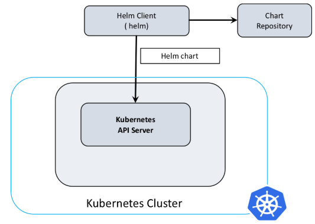

## Helm3 Architecture 

### Client Only Architecture

> Helm 3 has a client-only architecture with the client still called helm. As seen in the following diagram, it operates similar to the Helm 2 client, but the client interacts directly with the Kubernetes API server.

> Helm 3 is a single-service architecture. One executable is responsible for implementing Helm. There is no client/server split, nor is the core processing logic distributed among components.

> Implementation of Helm 3 is a single command-line client with no in-cluster server or controller. This tool exposes command-line operations, and unilaterally handles the package management process.

### ***The implementation has two distinct parts:***

1.    The command line façade, which translates commands, subcommands, flags, and arguments into a Helm operation
2.    The Helm library, which provides the logic for executing all Helm operations.

### **By design, the Helm library must be usable as a standalone library.**




### Install Helm version3

```
curl -fsSL -o get_helm.sh https://raw.githubusercontent.com/helm/helm/master/scripts/get-helm-3
chmod 700 get_helm.sh
./get_helm.sh
```

```
root@kube-master:~# helm version --short
v3.0.2+g19e47ee
```

### [Follow the Documentation for More](https://helm.sh/docs/intro/install/)

## Helm2 Architecture --- ***Not Used Anymore***

> **Helm2 has two major components:**

>> ***The `Helm Client` is a command-line client for end users. The client is responsible for the following domains:***

* Local chart development
* Managing repositories
* Interacting with the Tiller server
* Sending charts to be installed
* Asking for information about releases
* Requesting upgrading or uninstalling of existing releases


>> ***The `Tiller Server` is an in-cluster server that interacts with the Helm client, and interfaces with the Kubernetes API server. The server is responsible for the following:***

* Listening for incoming requests from the Helm client
* Combining a chart and configuration to build a release
* Installing charts into Kubernetes, and then tracking the subsequent release
* Upgrading and uninstalling charts by interacting with Kubernetes


### In a nutshell, the client is responsible for managing charts, and the server is responsible for managing releases.

### Install Helm version2  

### [Follow the Documentation to Install](https://v2.helm.sh/docs/using_helm/#installing-helm)